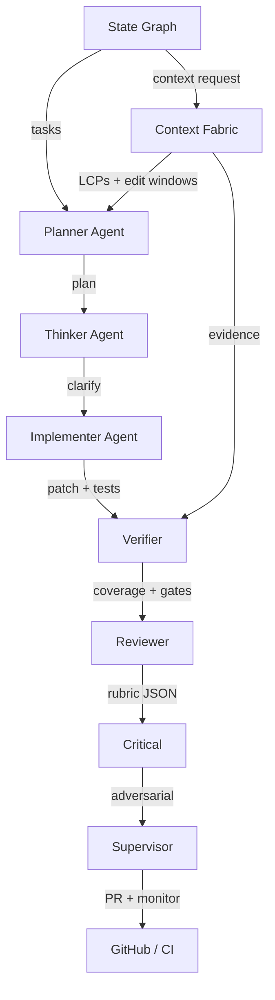

# Unified Autopilot Overview

The Unified Autopilot assembles Codex 5 and Claude 4.5 agents into a single production workflow that plans, implements, verifies, and monitors features across the WeatherVane stack. It enforces locked-provider routing, guards against prompt drift, and keeps every state observable with checkpoints, coverage data, and journals.

## Operating Model
- **States:** STRATEGIZE → SPEC → PLAN → THINK → IMPLEMENT → VERIFY → REVIEW → PR → MONITOR with automatic plan-delta and duplicate patch detection. (“Specify” terminology in legacy docs maps directly to SPEC.)
- **Agents:** Planner, Thinker, Implementer, Verifier, Reviewer, Critical, Supervisor. Each receives a scoped Local Context Pack (LCP) before acting.
- **Guardrails:** Tests + lint + type + security + license + changed-lines coverage. Verify failures trigger a resolution playbook instead of stalling.
- **Memory:** Run-ephemeral memory for local hints, project index for symbols/files, KB resources for style/DoD, decision journal snapshots per state.

## Architecture

## Components
- **State graph (`tools/wvo_mcp/src/orchestrator/state_graph.ts`)** controls retries, checkpoints, and router decisions.
- **Model router** locks requests to Codex 5 or Claude 4.5 variations with circuit breakers.
- **Context Fabric** (assembler, navigator, budgeting) delivers pointer-first LCPs, team panels, and handoff packages.
- **Atlas Kit** (this directory) keeps every subsystem self-describing for future agents.

## Knowledge & Evidence Flow
1. Planner uses roadmap metadata + file/test hints to size the change and choose scope budgets.
2. Context Assembler builds LCPs with anchors (code/tests/kb/decisions) and writes them to `resources://runs/<id>/context/`.
3. Verify enforces gating scripts, writes artifacts, and records router decisions for the run ledger.
4. Monitor runs synthetic smokes (with provider stubs for secrets) and records a final decision snapshot.

## Observability & Governance
- **Decision journal:** `resources://runs/<id>/journal.md` captures assumptions, plan deltas, and review outcomes.
- **Immutable phase ledger:** Append-only `state/process/ledger.jsonl` records every STRATEGIZE→MONITOR transition with hash chaining; orchestrator verifies the previous hash before accepting new work.
- **Deterministic phase leases:** Scheduler issues per-phase leases; next-state dispatch is blocked until the current lease closes with required evidence attached to the ledger entry.
- **Atlas manifest:** `docs/autopilot/MANIFEST.yml` ties components/policies/tools to hashes for drift detection, including prompt-header attestation.
- **Atlas CI:** `.github/workflows/atlas.yml` rebuilds/validates Atlas on every PR and blocks merges on drift or broken links.

Use this overview alongside the Agent README and Briefing Pack to bootstrap any Codex/Claude agent without rereading the entire codebase.
