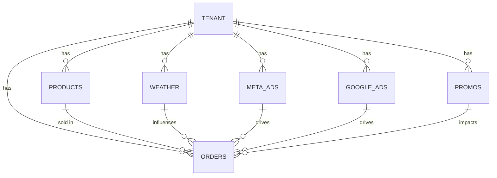

# Synthetic Data Dictionary

This document describes all data fields in the synthetic tenant datasets.

## Tenant Data Structure

### Products Table (`{tenant_id}_shopify_products`)
| Field | Type | Description | Example |
|-------|------|-------------|---------|
| tenant_id | string | Unique tenant identifier | "brand-harbor-cafe" |
| product_id | string | Product identifier | "brand-harbor-cafe-product-0" |
| title | string | Product name | "Harbor Cafe Warm Beverages" |
| product_type | string | Product category | "Warm Beverages" |
| vendor | string | Brand name | "Harbor Cafe" |
| created_at | datetime | Product creation timestamp | "2024-01-01T08:00:00Z" |
| updated_at | datetime | Last update timestamp | "2024-01-01T08:00:00Z" |

### Orders Table (`{tenant_id}_shopify_orders`)
| Field | Type | Description | Range/Example |
|-------|------|-------------|---------------|
| tenant_id | string | Tenant identifier | "brand-harbor-cafe" |
| order_id | string | Unique order ID | "brand-harbor-cafe-order-0-0" |
| name | string | Order name | "Harbor Cafe Warm Beverages 0" |
| created_at | datetime | Order timestamp | "2024-01-01T00:00:00Z" |
| currency | string | Currency code | "USD" |
| total_price | float | Total order amount | `subtotal_price + total_tax` |
| subtotal_price | float | Pre-tax amount | `net_revenue + total_discounts` |
| total_tax | float | Tax amount | 7% of subtotal |
| total_discounts | float | Discount amount | 8% of net revenue |
| net_revenue | float | Net revenue amount | Base revenue + weather effects |
| shipping_postal_code | string | Shipping ZIP | "94107" |
| shipping_country | string | Shipping country | "US" |
| ship_latitude | float | Shipping latitude | 37.7749 |
| ship_longitude | float | Shipping longitude | -122.4194 |
| ship_geohash | string | Location geohash | "9q8yy" |

### Meta Ads Table (`{tenant_id}_meta_ads`)
| Field | Type | Description | Range |
|-------|------|-------------|--------|
| tenant_id | string | Tenant identifier | - |
| date | date | Ad performance date | YYYY-MM-DD |
| campaign_id | string | Campaign identifier | "{tenant_id}-meta-campaign" |
| adset_id | string | Ad set identifier | "{tenant_id}-meta-adset-{n}" |
| spend | float | Daily ad spend | 44.0-70.0 base + growth |
| impressions | integer | Ad impressions | ~45x spend + noise |
| clicks | integer | Ad clicks | 2-12% of impressions |
| conversions | float | Conversion count | ~8% of spend + weather |

### Google Ads Table (`{tenant_id}_google_ads`)
| Field | Type | Description | Range |
|-------|------|-------------|--------|
| tenant_id | string | Tenant identifier | - |
| date | date | Ad performance date | YYYY-MM-DD |
| campaign_id | string | Campaign identifier | "{tenant_id}-google-campaign" |
| spend | float | Daily ad spend | 28.0-58.0 base + growth |
| impressions | integer | Ad impressions | ~42x spend + noise |
| clicks | integer | Ad clicks | 2-11% of impressions |
| conversions | float | Conversion count | ~7% of spend + weather |

### Promotions Table (`{tenant_id}_promos`)
| Field | Type | Description | Values |
|-------|------|-------------|--------|
| tenant_id | string | Tenant identifier | - |
| campaign_id | string | Promo identifier | "{tenant_id}-promo-{n}" |
| name | string | Campaign name | "{brand} {channel} Campaign {n}" |
| channel | string | Promo channel | email, sms, push, direct_mail, in_app |
| scheduled_at | datetime | Schedule timestamp | "YYYY-MM-DDT12:00:00Z" |
| status | string | Campaign status | "scheduled" or "draft" |

### Weather Table (`{tenant_id}_weather_daily`)
| Field | Type | Description | Range/Format |
|-------|------|-------------|--------------|
| date | date | Weather date | YYYY-MM-DD |
| local_date | date | Local date | YYYY-MM-DD |
| local_datetime | datetime | Local timestamp | "YYYY-MM-DDT06:00:00-08:00" |
| utc_datetime | datetime | UTC timestamp | "YYYY-MM-DDT14:00:00+00:00" |
| timezone | string | Timezone | "America/Los_Angeles" |
| geohash | string | Location geohash | 5-character precision |
| day_of_year | integer | Day of year | 1-366 |
| temp_c | float | Mean temperature °C | -20 to 40 |
| temp_max_c | float | Max temperature °C | temp_c + (0-10) |
| temp_min_c | float | Min temperature °C | temp_c - (0-10) |
| apparent_temp_c | float | Feels like °C | temp_c ± 5 |
| precip_mm | float | Precipitation mm | 0-100 |
| precip_probability | float | Precip chance | 0.0-1.0 |
| humidity_mean | float | Mean humidity | 0.0-1.0 |
| windspeed_max | float | Max wind m/s | 0-35 |
| uv_index_max | float | Max UV index | 0-12 |
| snowfall_mm | float | Snowfall mm | 0-100 |

### Derived Weather Features
| Field | Type | Description | Calculation |
|-------|------|-------------|-------------|
| temp_anomaly | float | Temperature deviation | Current - 7-day mean |
| precip_anomaly | float | Precipitation deviation | Current - 7-day mean |
| temp_roll7 | float | 7-day temp average | Mean of 7 days |
| precip_roll7 | float | 7-day precip average | Mean of 7 days |
| temp_c_lag1 | float | Previous day temp | Previous temp_c |
| precip_mm_lag1 | float | Previous day precip | Previous precip_mm |
| uv_index_lag1 | float | Previous day UV | Previous uv_index_max |
| precip_probability_lag1 | float | Previous precip chance | Previous probability |
| humidity_lag1 | float | Previous humidity | Previous humidity_mean |

### Weather Event Flags
| Field | Type | Description | Threshold |
|-------|------|-------------|-----------|
| freeze_flag | integer | Freezing temps | temp_min ≤ 0°C |
| heatwave_flag | integer | Heat wave | temp_max ≥ 30°C |
| snow_event_flag | integer | Snow event | snowfall > 0.1mm |
| high_wind_flag | integer | High winds | windspeed_max ≥ 20 m/s |
| uv_alert_flag | integer | UV warning | uv_index_max ≥ 8 |
| high_precip_prob_flag | integer | High rain chance | probability ≥ 0.6 |

## Data Relationships

## Key Interactions

1. **Weather → Revenue**: Weather conditions directly impact net revenue through:
   - Base weather sensitivity profile of brand
   - Product-specific weather sensitivities
   - Marketing spend weather amplification

2. **Marketing → Revenue**: Marketing activities affect revenue via:
   - Direct conversion rates from ad spend
   - Weather-adjusted click and conversion rates
   - Promotional campaign activation

3. **Product Mix → Sensitivity**: Overall weather sensitivity depends on:
   - Individual product category weather coefficients
   - Category revenue weights
   - Seasonal variations in product mix