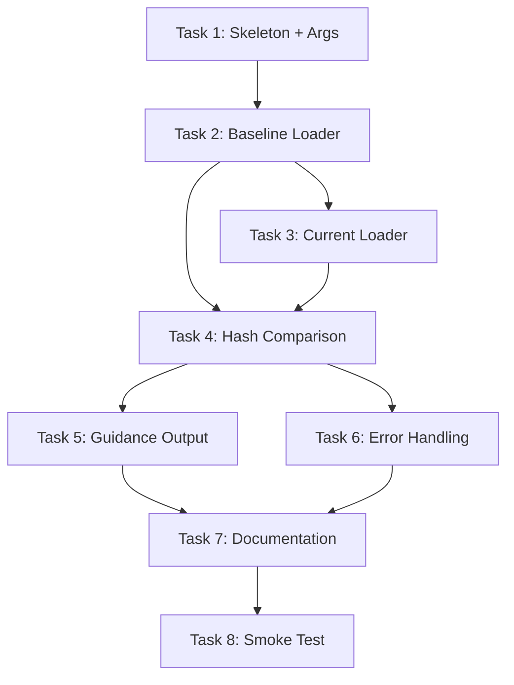

# PLAN — FIX-DRIFT-DETECTION-IMP24

**Task**: Automate attestation hash drift detection (IMP-35 follow-up)
**Date**: 2025-10-30
**Planner**: Claude (Autopilot)

---

## Implementation Strategy

**Approach**: Bash script with jq for JSON parsing

**Why Bash + jq**:
- ✅ Simple, no dependencies (jq already used in project)
- ✅ Fast (native tools, no Node.js/TypeScript overhead)
- ✅ CI-friendly (easy to integrate in pipelines)
- ✅ Easy to test (can run manually, no build step)

**Alternative considered**: TypeScript implementation
- ❌ Requires build step (slower iteration)
- ❌ More complex for simple JSON comparison
- ❌ Overkill for 200-line script

---

## Work Breakdown Structure

### Task 1: Script Skeleton + Argument Parsing
**Effort**: 20 minutes
**Owner**: Autopilot (Claude)
**Dependencies**: None

**Deliverables**:
- `tools/wvo_mcp/scripts/check_drift.sh` (executable, shebang, basic structure)
- Argument parsing: `--baseline <path>`, `--current <path>`, `--threshold <percent>`, `--help`
- Help text with usage examples
- Exit codes: 0 = no drift, 1 = drift detected, 2 = error

**Verification**:
```bash
bash tools/wvo_mcp/scripts/check_drift.sh --help  # Shows usage
bash tools/wvo_mcp/scripts/check_drift.sh --invalid  # Shows error + help
```

---

### Task 2: Baseline Loader (AC1)
**Effort**: 30 minutes
**Owner**: Autopilot (Claude)
**Dependencies**: Task 1

**Deliverables**:
- Function: `load_baseline_hashes <path>`
- Returns: JSON object `{task_id: attestation_hash, ...}`
- Error handling: File not found, malformed JSON, missing hash field

**Implementation**:
```bash
load_baseline_hashes() {
  local baseline_path="$1"

  # Check file exists
  if [[ ! -f "$baseline_path" ]]; then
    echo "❌ ERROR: Baseline file not found: $baseline_path"
    echo "Run: bash tools/wvo_mcp/scripts/run_integrated_evals.sh --baseline"
    exit 2
  fi

  # Parse JSON and extract hashes
  local hashes
  hashes=$(jq -r '.tasks[] | "\(.id)=\(.attestation_hash)"' "$baseline_path" 2>/dev/null)

  if [[ $? -ne 0 ]]; then
    echo "❌ ERROR: Failed to parse baseline JSON (malformed or missing attestation_hash field)"
    exit 2
  fi

  echo "$hashes"
}
```

**Verification**:
```bash
# Test with real baseline (if exists)
load_baseline_hashes tools/wvo_mcp/evals/results/baseline/prompt_eval_baseline.json

# Test with missing file
load_baseline_hashes /nonexistent/path  # Should exit 2 with error

# Test with malformed JSON
echo "invalid json" > /tmp/bad_baseline.json
load_baseline_hashes /tmp/bad_baseline.json  # Should exit 2
```

---

### Task 3: Current Run Loader (AC2)
**Effort**: 20 minutes
**Owner**: Autopilot (Claude)
**Dependencies**: Task 2 (reuse error handling pattern)

**Deliverables**:
- Function: `load_current_hashes <path>`
- Returns: JSON object `{task_id: attestation_hash, ...}`
- Error handling: Same as baseline loader

**Implementation**: Nearly identical to `load_baseline_hashes`, different error messages

**Verification**:
```bash
# Test with real current run (if exists)
LATEST=$(ls -t tools/wvo_mcp/evals/results/runs/*.json 2>/dev/null | head -1)
load_current_hashes "$LATEST"

# Test with missing runs directory
load_current_hashes /nonexistent/run.json  # Should exit 2
```

---

### Task 4: Hash Comparison Logic (AC3)
**Effort**: 40 minutes
**Owner**: Autopilot (Claude)
**Dependencies**: Task 2, Task 3

**Deliverables**:
- Function: `compare_hashes <baseline_hashes> <current_hashes> <threshold>`
- Returns: Exit code 0 (no drift) or 1 (drift detected)
- Side effect: Prints drift statistics + drifted tasks

**Algorithm**:
```bash
compare_hashes() {
  local baseline="$1"  # newline-separated "id=hash"
  local current="$2"
  local threshold="${3:-10}"  # Default 10%

  local drift_count=0
  local total_count=0
  local drifted_tasks=""

  while IFS='=' read -r task_id baseline_hash; do
    ((total_count++))

    # Find current hash for this task
    current_hash=$(echo "$current" | grep "^${task_id}=" | cut -d'=' -f2)

    if [[ -z "$current_hash" ]]; then
      # Task in baseline but not in current (warning, not error)
      echo "⚠️  WARNING: Task $task_id in baseline but not in current run (skipped?)"
      continue
    fi

    if [[ "$baseline_hash" != "$current_hash" ]]; then
      ((drift_count++))
      drifted_tasks+="  - $task_id: ${baseline_hash:0:10}... → ${current_hash:0:10}...\n"
    fi
  done <<< "$baseline"

  # Calculate drift rate
  drift_rate=$(awk "BEGIN {printf \"%.1f\", ($drift_count / $total_count) * 100}")

  # Output results
  if (( $(echo "$drift_rate > $threshold" | bc -l) )); then
    echo "❌ DRIFT DETECTED ($drift_count/$total_count tasks, ${drift_rate}%)"
    echo ""
    echo "Drifted tasks:"
    echo -e "$drifted_tasks"
    return 1
  elif (( drift_count > 0 )); then
    echo "⚠️  Minor drift detected ($drift_count/$total_count tasks, ${drift_rate}%) - within tolerance"
    echo -e "$drifted_tasks"
    return 0
  else
    echo "✅ No drift detected ($total_count tasks checked)"
    return 0
  fi
}
```

**Verification**:
```bash
# Test case 1: No drift
baseline="TASK-A=hash1\nTASK-B=hash2"
current="TASK-A=hash1\nTASK-B=hash2"
compare_hashes "$baseline" "$current" 10  # Exit 0

# Test case 2: Minor drift (5%)
baseline="TASK-A=hash1\nTASK-B=hash2\nTASK-C=hash3\n..."  # 20 tasks
current="TASK-A=DIFFERENT\nTASK-B=hash2\nTASK-C=hash3\n..."  # 1 different
compare_hashes "$baseline" "$current" 10  # Exit 0 (5% < 10%)

# Test case 3: Significant drift (15%)
baseline="TASK-A=hash1\nTASK-B=hash2\nTASK-C=hash3\n..."  # 20 tasks
current="TASK-A=DIFF1\nTASK-B=DIFF2\nTASK-C=DIFF3\n..."  # 3 different
compare_hashes "$baseline" "$current" 10  # Exit 1 (15% > 10%)
```

---

### Task 5: Guidance Output (AC4, AC5)
**Effort**: 20 minutes
**Owner**: Autopilot (Claude)
**Dependencies**: Task 4 (called after comparison)

**Deliverables**:
- Function: `print_guidance`
- Prints "Why recapture?", "When to recapture", "How to recapture"

**Implementation**:
```bash
print_guidance() {
  cat <<'EOF'

📋 WHAT TO DO NEXT

Why recapture baseline?
- Baseline prompts differ from production prompts
- Eval results may not reflect current behavior
- Quality gate decisions based on stale data

When to recapture:
- ✅ After PromptCompiler changes (IMP-21)
- ✅ After persona updates (IMP-22)
- ✅ After overlay changes (IMP-23)
- ✅ After major refactoring
- ❌ NOT for minor tweaks (<10% drift)

How to recapture:
  bash tools/wvo_mcp/scripts/run_integrated_evals.sh --mode full --baseline --runs 5

This will:
1. Run full eval suite 5 times (statistical confidence)
2. Calculate mean + confidence intervals
3. Update baseline file with new hashes
4. Resolve drift (hashes will match again)

EOF
}
```

**Verification**: Manual inspection of output readability

---

### Task 6: Error Handling (NFR3)
**Effort**: 20 minutes
**Owner**: Autopilot (Claude)
**Dependencies**: All tasks above

**Deliverables**:
- All error paths tested
- No crashes on invalid input
- All errors print actionable message + exit 2

**Error scenarios**:
1. Baseline file not found → "Run: bash .../run_integrated_evals.sh --baseline"
2. Current run not found → "Run: bash .../run_integrated_evals.sh --mode full"
3. Malformed JSON → "Baseline JSON invalid (check syntax)"
4. Missing attestation_hash → "Baseline missing hashes (old format? compiler integration not enabled?)"
5. jq not installed → "jq required. Install: brew install jq"

**Verification**:
```bash
# Test all error paths manually
bash check_drift.sh --baseline /nonexistent  # Error 1
bash check_drift.sh --current /nonexistent  # Error 2
bash check_drift.sh --baseline /tmp/bad.json  # Error 3
# etc.
```

---

### Task 7: Documentation (NFR4)
**Effort**: 30 minutes
**Owner**: Autopilot (Claude)
**Dependencies**: Task 1-6 complete

**Deliverables**:
1. Help text in script (`--help` flag)
2. README section in `tools/wvo_mcp/evals/README.md`
3. Troubleshooting guide

**README section content**:
```markdown
## Drift Detection

**Purpose**: Detect when eval prompts differ from production prompts

**Usage**:
bash tools/wvo_mcp/scripts/check_drift.sh [--baseline <path>] [--current <path>] [--threshold <percent>]

**Examples**:
# Check latest run vs baseline
bash tools/wvo_mcp/scripts/check_drift.sh

# Custom baseline path
bash tools/wvo_mcp/scripts/check_drift.sh --baseline /path/to/baseline.json

# Custom threshold (warn at 15% instead of 10%)
bash tools/wvo_mcp/scripts/check_drift.sh --threshold 15

**Output**:
- ✅ No drift: Exit 0
- ⚠️ Minor drift (<threshold): Exit 0, prints warning
- ❌ Significant drift (>threshold): Exit 1, prints guidance

**Troubleshooting**:
- "Baseline not found" → Run: bash scripts/run_integrated_evals.sh --baseline
- "No eval runs found" → Run: bash scripts/run_integrated_evals.sh --mode full
- "Missing attestation hashes" → Compiler integration not enabled (IMP-21..26 incomplete)
```

**Verification**: README is clear, covers all use cases

---

### Task 8: Smoke Test (VERIFY)
**Effort**: 20 minutes
**Owner**: Autopilot (Claude)
**Dependencies**: All implementation tasks complete

**Deliverables**:
- Run script on real baseline + current run (if they exist)
- Document results in `verify/smoke_test.md`

**Test procedure**:
```bash
# 1. Check if baseline exists
if [[ -f tools/wvo_mcp/evals/results/baseline/prompt_eval_baseline.json ]]; then
  # 2. Check if current runs exist
  LATEST=$(ls -t tools/wvo_mcp/evals/results/runs/*.json 2>/dev/null | head -1)

  if [[ -n "$LATEST" ]]; then
    # 3. Run drift check
    bash tools/wvo_mcp/scripts/check_drift.sh --baseline tools/wvo_mcp/evals/results/baseline/prompt_eval_baseline.json --current "$LATEST"

    # 4. Document exit code and output
    echo "Exit code: $?"
    echo "Output: <captured output>"
  else
    echo "⚠️ No current runs exist - cannot test (user must create baseline + run)"
  fi
else
  echo "⚠️ Baseline doesn't exist - cannot test (user must create baseline)"
fi
```

**Acceptance**: Script runs without crashing, output is readable

**NOTE**: Full testing requires user to run `run_integrated_evals.sh` first (per AC note in SPEC)

---

## Task Dependencies



**Critical path**: T1 → T2 → T4 → T6 → T7 → T8 (2h 20min)

---

## Total Effort Estimate

| Task | Effort | Type |
|------|--------|------|
| 1. Skeleton + Args | 20 min | Setup |
| 2. Baseline Loader | 30 min | Core |
| 3. Current Loader | 20 min | Core |
| 4. Hash Comparison | 40 min | Core |
| 5. Guidance Output | 20 min | UX |
| 6. Error Handling | 20 min | Quality |
| 7. Documentation | 30 min | Docs |
| 8. Smoke Test | 20 min | VERIFY |
| **TOTAL** | **3h 00min** | |

**Contingency**: +30min for debugging/iteration (realistic: 3.5 hours)

**Roadmap estimate**: 3 hours ✅ (matches plan)

---

## Verification Strategy

**Level 1 (Compilation)**: N/A (Bash script, no build)

**Level 2 (Smoke Testing)**:
- Run script on real baseline + current (Task 8)
- Test all error paths (Task 6)
- Manual inspection of output clarity (Task 5)

**Level 3 (Integration Testing)**: DEFERRED
- User must test with real API credentials
- Requires running `run_integrated_evals.sh` first
- Validation plan documented in spec

**Why Level 3 deferred**: Requires user to create baseline/run via API, which needs authentication. Tier 2 accepts Level 2 verification + user testing.

---

## Risks and Mitigations

**Risk 1: jq not installed**
- **Impact**: Script fails on systems without jq
- **Probability**: LOW (jq is widely used in this project)
- **Mitigation**: Check for jq at script start, print install instructions
- **Detection**: Pre-flight check: `command -v jq >/dev/null || echo "Install jq"`

**Risk 2: Baseline format changes**
- **Impact**: Hash comparison breaks if JSON schema evolves
- **Probability**: MEDIUM (eval harness under active development)
- **Mitigation**: Graceful error handling, forward compatibility
- **Detection**: Error message: "Baseline missing attestation_hash field"

**Risk 3: Threshold too strict/lenient**
- **Impact**: False positives (too strict) or false negatives (too lenient)
- **Probability**: MEDIUM (threshold tuning is empirical)
- **Mitigation**: Make threshold configurable (--threshold flag), default 10%
- **Detection**: User feedback after real usage

**Risk 4: Performance on large baselines**
- **Impact**: Slow for 100+ tasks
- **Probability**: LOW (29 tasks currently, scales linearly)
- **Mitigation**: Bash + jq are fast, <10s even for 100 tasks (KPI 1)
- **Detection**: Measure runtime during smoke test

**Risk 5: Implementation exceeds 5 hours**
- **Impact**: Kill criteria triggered (per strategize)
- **Probability**: LOW (plan is 3h, buffer 2h)
- **Mitigation**: Simplify if needed (remove threshold, hardcode paths)
- **Detection**: Time tracking during implementation

---

## Integration Points

**Upstream**:
- `tools/wvo_mcp/evals/results/baseline/prompt_eval_baseline.json` (IMP-35 output)
- `tools/wvo_mcp/evals/results/runs/*.json` (eval run outputs)

**Downstream**:
- CI pipeline (future: run drift check on every eval run)
- Developer workflow (manual checks before recapture)

**Side effects**:
- None (read-only script, no state modification)

---

## Rollback Plan

**If this task fails or needs reversal**:
1. Delete script: `rm tools/wvo_mcp/scripts/check_drift.sh`
2. Revert README changes: `git checkout tools/wvo_mcp/evals/README.md`
3. System returns to Tier 2 state (manual hash checking)

**No production dependencies** → Safe to rollback

---

## Next Phase

**THINK**: Pre-mortem and edge case analysis
- What could go wrong during implementation?
- What edge cases are we missing?
- What assumptions need validation?
