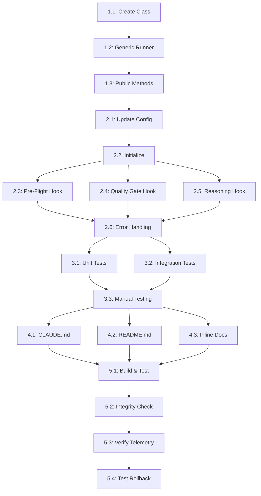

# PLAN: WorkProcessEnforcer Quality Integration

**Task**: FIX-INTEGRATION-WorkProcessEnforcer
**Date**: 2025-10-30
**Phase**: PLAN
**Estimated Total**: 3 hours

---

## Implementation Tasks

### Phase 1: Foundation (45 minutes)

#### Task 1.1: Create WorkProcessQualityIntegration Class (20 min)
**File**: `tools/wvo_mcp/src/orchestrator/work_process_quality_integration.ts`

**Actions:**
- Define QualityCheckConfig interface (mode, preflight, qualityGates, reasoning, failSafe)
- Define QualityCheckResult interface (passed, timedOut, error, blockTransition, details)
- Create WorkProcessQualityIntegration class skeleton
- Add constructor (config, workspaceRoot, metricsCollector)
- Add private runCheck method (generic script executor with timeout)
- Add private shouldBlockTransition method (mode logic)
- Add private logQualityCheckEvent method (telemetry)

**Output**: ~300 LOC, compiles, exports interfaces

#### Task 1.2: Implement Generic Check Runner (15 min)
**Method**: `private async runCheck(...)`

**Actions:**
- Execute script with spawn/execSync
- Implement timeout handling (timeoutMs parameter)
- Implement error handling (catch, log, return fail-safe result)
- Parse JSON output from script
- Calculate execution time
- Determine blockTransition based on mode + result + failSafe

**Output**: Generic runner that works for any check script

#### Task 1.3: Implement Public Check Methods (10 min)
**Methods**:
- `async runPreflightChecks(taskId)`
- `async runQualityGates(taskId)`
- `async runReasoningValidation(taskId)`

**Actions:**
- Call runCheck with appropriate scriptPath
- Pass taskId as parameter (for reasoning)
- Log telemetry with checkType
- Return QualityCheckResult

**Output**: 3 public methods, ~50 LOC

---

### Phase 2: Integration (30 minutes)

#### Task 2.1: Update WorkProcessEnforcer Config (5 min)
**File**: `tools/wvo_mcp/src/orchestrator/work_process_enforcer.ts`

**Actions:**
- Import WorkProcessQualityIntegration and QualityCheckConfig
- Add qualityChecks?: QualityCheckConfig to WorkProcessEnforcerConfig interface
- Add private qualityIntegration?: WorkProcessQualityIntegration field

**Output**: Config interface updated

#### Task 2.2: Initialize Quality Integration (5 min)
**Location**: WorkProcessEnforcer constructor

**Actions:**
- Check if config.qualityChecks provided
- Instantiate WorkProcessQualityIntegration
- Assign to this.qualityIntegration
- Log initialization (enabled mode)

**Output**: Quality integration initialized when config present

#### Task 2.3: Add Pre-Flight Hook (before IMPLEMENT) (5 min)
**Location**: `advanceToPhase` method

**Actions:**
- Check if newPhase === 'implement'
- Call this.qualityIntegration.runPreflightChecks(taskId)
- Check result.blockTransition
- Throw error if blocked (with failure details)
- Log transition allowed/blocked

**Output**: Pre-flight checks enforced before IMPLEMENT

#### Task 2.4: Add Quality Gate Hook (before VERIFY) (5 min)
**Location**: `advanceToPhase` method

**Actions:**
- Check if newPhase === 'verify'
- Call this.qualityIntegration.runQualityGates(taskId)
- Check result.blockTransition
- Throw error if blocked (with violation details)

**Output**: Quality gates enforced before VERIFY

#### Task 2.5: Add Reasoning Hook (before MONITOR) (5 min)
**Location**: `advanceToPhase` method

**Actions:**
- Check if newPhase === 'monitor'
- Call this.qualityIntegration.runReasoningValidation(taskId)
- Check result.blockTransition
- Throw error if blocked (with validation details)

**Output**: Reasoning validation enforced before MONITOR

#### Task 2.6: Add Error Handling (5 min)
**Location**: Around quality check calls

**Actions:**
- Wrap each quality check in try-catch
- Log error if quality check throws
- Don't block if failSafe=true
- Record error in telemetry

**Output**: Fail-safe error handling

---

### Phase 3: Testing (60 minutes)

#### Task 3.1: Unit Tests - Quality Integration (20 min)
**File**: `tools/wvo_mcp/src/orchestrator/__tests__/work_process_quality_integration.test.ts`

**Tests:**
1. Constructor initializes config
2. runPreflightChecks calls script and parses output
3. runQualityGates calls script and parses output
4. runReasoningValidation calls script with --task
5. Timeout handling (mock slow script)
6. Error handling (mock script failure)
7. shouldBlockTransition logic for each mode
8. Telemetry logged for all checks

**Output**: 8+ unit tests, all green

#### Task 3.2: Integration Tests - WorkProcessEnforcer (25 min)
**File**: `tools/wvo_mcp/src/orchestrator/__tests__/work_process_enforcer.quality.integration.test.ts`

**Tests:**
1. Happy path: all checks pass, phases advance
2. Pre-flight failure blocks IMPLEMENT (enforce mode)
3. Quality gate failure blocks VERIFY (enforce mode)
4. Reasoning failure blocks MONITOR (enforce mode)
5. Timeout doesn't block (fail-safe)
6. Shadow mode: checks run, don't block
7. Feature flag disabled: no checks run

**Output**: 7+ integration tests, all green

#### Task 3.3: Manual Testing (15 min)
**Actions:**
- Build project (npm run build)
- Run test suite (npm test)
- Create TEST-INTEGRATION-QC task with quality violation
- Test with shadow mode (observe only)
- Test with enforce mode (blocking)
- Verify telemetry files generated

**Output**: Manual test checklist complete

---

### Phase 4: Documentation (25 minutes)

#### Task 4.1: Update CLAUDE.md (10 min)
**Section**: "Quality & Reasoning Assurance System"

**Actions:**
- Add "Autopilot Integration" subsection
- Explain automatic quality checks
- Document feature flag modes (shadow/observe/enforce)
- Show example config
- Link to work_process_quality_integration.ts

**Output**: CLAUDE.md updated with autopilot integration docs

#### Task 4.2: Update README.md (10 min)
**File**: `tools/wvo_mcp/README.md`

**Actions:**
- Add "Quality Integration" section
- Explain how WorkProcessEnforcer uses quality checks
- Show configuration example
- Document telemetry outputs
- Link to quality check scripts

**Output**: README.md updated

#### Task 4.3: Add Inline Documentation (5 min)
**Files**: work_process_quality_integration.ts, work_process_enforcer.ts

**Actions:**
- Add JSDoc comments to all public methods
- Document parameters and return types
- Explain fail-safe behavior
- Add examples for config

**Output**: Well-documented code

---

### Phase 5: Verification (20 minutes)

#### Task 5.1: Run Full Build & Test (5 min)
**Commands:**
```bash
npm run build
npm run typecheck
npm test
```

**Expected**: 0 errors, all tests pass

#### Task 5.2: Run Integration Check (5 min)
**Command:**
```bash
bash tools/wvo_mcp/scripts/run_integrity_tests.sh
```

**Expected**: All integrity checks pass

#### Task 5.3: Verify Telemetry (5 min)
**Actions:**
- Check state/analytics/preflight_runs.jsonl
- Check state/analytics/quality_gates.jsonl
- Check state/analytics/reasoning_validation.jsonl
- Verify JSON structure matches spec

**Expected**: Telemetry files populated with valid JSON

#### Task 5.4: Test Rollback (5 min)
**Actions:**
- Disable quality checks via feature flag
- Verify autopilot works without checks
- Re-enable checks
- Verify checks run again

**Expected**: Feature flag controls work correctly

---

## Task Dependency Graph



**Critical Path**: 1.1 → 1.2 → 1.3 → 2.1 → 2.2 → 2.3/2.4/2.5 → 2.6 → 3.1/3.2 → 3.3 → 5.1
**Estimated**: 3 hours (matches task estimate)

---

## Implementation Order

### Rationale for Order

**1. Foundation First (Phase 1)**
- Build reusable quality integration module
- Generic runCheck method enables all check types
- Testable in isolation (no WorkProcessEnforcer dependency)

**2. Integration Second (Phase 2)**
- Wire quality module into WorkProcessEnforcer
- Add hooks at correct phase transitions
- Error handling ensures fail-safe behavior

**3. Testing Third (Phase 3)**
- Unit tests validate quality module logic
- Integration tests validate WorkProcessEnforcer hooks
- Manual testing validates end-to-end workflow

**4. Documentation Fourth (Phase 4)**
- After implementation solidified
- Examples can reference actual code

**5. Verification Fifth (Phase 5)**
- Final checks before declaring complete
- Telemetry proves automatic execution

---

## Risk Mitigation Plan

### Risk: Script Execution Failures
**Mitigation in Plan:**
- Task 1.2: Generic runner with timeout/error handling
- Task 2.6: Fail-safe error handling around all checks
- Task 3.1: Unit tests for timeout/error scenarios

### Risk: Performance Degradation
**Mitigation in Plan:**
- Use aggressive timeouts (30s/15s/20s)
- Task 5.3: Verify execution time in telemetry
- Defer optimization to future if needed

### Risk: Integration Bugs
**Mitigation in Plan:**
- Task 3.2: Comprehensive integration tests
- Task 3.3: Manual testing with real workflow
- Task 5.4: Test rollback (feature flag disable)

### Risk: False Positives
**Mitigation in Plan:**
- Start in shadow mode (no blocking)
- Task 5.3: Verify telemetry shows check results
- Tuning deferred to post-deployment analysis

---

## Rollback Plan

### If Integration Breaks Autopilot

**Immediate Rollback (5 min):**
```bash
# Option 1: Disable via feature flag
# Edit tools/wvo_mcp/src/session.ts or environment
QUALITY_CHECKS_ENABLED=false npm start

# Option 2: Revert commit
git revert <commit-hash>
git push

# Option 3: Emergency fix - comment out hooks
# Edit work_process_enforcer.ts, comment out quality check calls
```

**Verification:**
```bash
# Verify autopilot works without quality checks
npm run build
npm test
# Check if state transitions work normally
```

### If Quality Checks Timeout Excessively

**Config Adjustment:**
```typescript
{
  qualityChecks: {
    mode: 'shadow',  // disable blocking
    preflight: { timeoutMs: 60000 },  // increase timeout
    failSafe: true  // ensure fail-safe enabled
  }
}
```

---

## Success Metrics

### Implementation Success
- ✅ All code compiles (0 TypeScript errors)
- ✅ All unit tests pass (8+ tests)
- ✅ All integration tests pass (7+ tests)
- ✅ Manual testing checklist complete
- ✅ Documentation updated (CLAUDE.md + README.md)

### Functional Success
- ✅ Quality checks run automatically at phase transitions
- ✅ Results logged to telemetry files
- ✅ Feature flag controls mode (shadow/observe/enforce)
- ✅ Timeouts handled gracefully (fail-safe)
- ✅ Blocking works in enforce mode

### Performance Success
- ✅ Pre-flight <30s (p95)
- ✅ Quality gates <15s (p95)
- ✅ Reasoning validation <20s (p95)
- ✅ Total overhead <5 min per workflow

---

## Definition of "Done" for PLAN Phase

This PLAN is complete when:
1. ✅ All implementation tasks defined with time estimates
2. ✅ Task dependencies clear (dependency graph)
3. ✅ Implementation order justified
4. ✅ Risk mitigation integrated into plan
5. ✅ Rollback plan documented
6. ✅ Success metrics defined

**Status**: ✅ COMPLETE - ready for THINK phase

---

**Next Phase**: THINK - analyze assumptions, edge cases, pre-mortem
